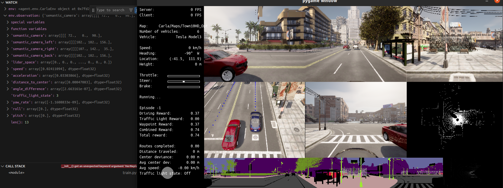

<!-- Improved compatibility of back to top link: See: https://github.com/othneildrew/Best-README-Template/pull/73 -->
<a name="readme-top"></a>
<!--
*** Thanks for checking out the Best-README-Template. If you have a suggestion
*** that would make this better, please fork the repo and create a pull request
*** or simply open an issue with the tag "enhancement".
*** Don't forget to give the project a star!
*** Thanks again! Now go create something AMAZING! :D
-->


<!-- PROJECT SHIELDS -->
<!--
*** I'm using markdown "reference style" links for readability.
*** Reference links are enclosed in brackets [ ] instead of parentheses ( ).
*** See the bottom of this document for the declaration of the reference variables
*** for contributors-url, forks-url, etc. This is an optional, concise syntax you may use.
*** https://www.markdownguide.org/basic-syntax/#reference-style-links
-->


<!-- PROJECT LOGO -->
<br />
<div align="center">
  <a href="https://github.com/donymorph/Dongfeng_competition">
    
  </a>

<h3 align="center">Autonomous Vehicles with Carla</h3>

  <p align="center">
    This repository prepared for the Dongfeng competition
    <br />
    THIS REPO  IS UNDER DEVELOPMENT DEADLINE  JUNE 2024
    <br />
    <a href="https://github.com/donymorph/Dongfeng_competition"><strong>Explore the docs #coming soon »</strong></a>
    <br />
    <br />
    <a href="https://github.com/github_username/repo_name">View Demo #coming soon </a>
    ·
    <a href="https://github.com/donymorph/Dongfeng_competition/issues">Report Bug</a>
    ·
    <a href="https://github.com/donymorph/Dongfeng_competition/issues">Request Feature</a>
  </p>
</div>
<br />

<div align="center">
<a href="https://github.com/donymorph/Dongfeng_competition/RL_SB3"><strong>RL SB3 user interface</strong></a>
  <a href="https://github.com/donymorph/Dongfeng_competition">
    
  </a>
</div>


<!-- TABLE OF CONTENTS -->
<details>
  <summary>Table of Contents</summary>
  <ol>
    <li>
      <a href="#about-the-project">About The Project</a>
    <li>
      <a href="#getting-started">Getting Started</a>
      <ul>
        <li><a href="#Setup">Setup</a></li>
        <li><a href="#Pre-Trained Models">Pre-Trained Models</a></li>
      </ul>
    </li>
    <li><a href="#usage">Usage</a></li>
    <li><a href="#contributing">Contributing</a></li>
    <li><a href="#contact">Contact</a></li>
    <li><a href="#acknowledgments">Acknowledgments</a></li>
  </ol>
</details>


<!-- ABOUT THE PROJECT -->
## About The Project  ## needs to edit

[![Product Name Screen Shot][product-screenshot]](https://example.com)

Here's a blank template to get started: To avoid retyping too much info. Do a search and replace with your text editor for the following: `github_username`, `repo_name`, `twitter_handle`, `linkedin_username`, `email_client`, `email`, `project_title`, `project_description`

<p align="right">(<a href="#readme-top">back to top</a>)</p>


<!-- GETTING STARTED -->
## Getting Started

Install Carla simulator [carla.org](https://github.com/carla-simulator/carla)  no less than 0.9.12 version. recommended 0.9.15 

### Setup

Clone the repo, setup CARLA 0.9.14 or 0.9.15, and build the conda environment:
* 
  ```
  git clone https://github.com/donymorph/Dongfeng_competition.git
  cd Dongfeng_competition
  conda create -n carla python=3.8
  conda activate carla
  pip install -r requirements.txt
  ```

### Pre-Trained Models
#### CARLA_GARAGE
1. Download the pretened models for Carla garage [here](https://s3.eu-central-1.amazonaws.com/avg-projects-2/jaeger2023arxiv/models/pretrained_models.zip).
2. Unzip and put them in the imitation_learning/carla_garage folder
#### Interfuser 
1. Download the pretrained model for Interfuser [here](http://43.159.60.142/s/p2CN)
2. put it in the imitation_learning/Interfuser folder no need to uzip
#### TCP 
1. Download the pretrained model for TCP here [here](https://drive.google.com/file/d/1DaDCrSE6_SmpKa1bkrb3cOXxcnnHGQ8P/view?usp=sharing)
2. put it in the imitation_learning/TCP folder uzip it
#### Transfuser 
1. Download the pretrained model for Interfuser here [here](https://s3.eu-central-1.amazonaws.com/avg-projects/transfuser/models_2022.zip)
2. put it in the imitation_learning/Interfuser folder uzip it
<p align="right">(<a href="#readme-top">back to top</a>)</p>


<!-- USAGE EXAMPLES -->
## Usage
1. first go to [agents](https://github.com/donymorph/Dongfeng_competition/tree/main/agents) folder and try to understand the fundamentals of CARLA by running some example code in the [example](https://github.com/donymorph/Dongfeng_competition/tree/main/agents/examples) folder. [Carla Documentation](https://carla.readthedocs.io/)
2. Test it 
    ```
    python agents/examples/manual_control.py
    ```
3. Test RL in the [RL+SB3_new](https://github.com/donymorph/Dongfeng_competition/tree/main/RL%2BSB3) folder and evaluate the trained [models](https://github.com/donymorph/Dongfeng_competition/tree/main/RL%2BSB3/tensorboard). It used [Stable Baseline3](https://stable-baselines3.readthedocs.io/en/master/) to train RL models
    ```
    python RL_SB3_new/train.py ## for training
    python RL_SB3_new/evaluate.py ## for evaluation 
    ```
    it takes following arguments 
    ```
    usage: eval.py [-h] [--host HOST] [--port PORT] --model MODEL [--no_render] [--fps FPS] [--no_record_video] [--config CONFIG]
    ```
4. Evaluate [Carla garage](https://github.com/donymorph/Dongfeng_competition/tree/main/imitation_learning/carla_garage) Trained models with [Carla leaderboard 2](https://leaderboard.carla.org/get_started/) 
    ```
    python leaderboard/leaderboard_evaluator.py --agent imitation_learning/sensor_agent.py --routes routes/routes_town10.xml --agent-config pretened_models/leaderboard/ttpp_wp_all_0
    ```
5. Evaluate [Interfuser](https://github.com/donymorph/Dongfeng_competition/tree/main/imitation_learning/interfuser) Trained model with [Carla leaderboard 2](https://leaderboard.carla.org/get_started/)
    ```
    python leaderboard/leaderboard_evaluator.py -a imitation_learning/interfuser/interfuser_agent.py --agent-config imitation_learning/interfuser/interfuser_config.py --routes routes/routes_town10.xml
    ```
6. Evaluate [TCP](https://github.com/donymorph/Dongfeng_competition/tree/main/imitation_learning/TCP) Trained model with [Carla leaderboard 2](https://leaderboard.carla.org/get_started/)
    ```
    python leaderboard/leaderboard_evaluator.py -a imitation_learning/TCP/tcp_agent.py --agent-config imitation_learning/TCP/new.ckpt --routes routes/routes_town10.xml
    ```
7. Evaluate [Transfuser](https://github.com/donymorph/Dongfeng_competition/tree/main/imitation_learning/transfuser) Trained model with [Carla leaderboard 2](https://leaderboard.carla.org/get_started/) || not working mmcv and mmdet conflicts
    ```
    python leaderboard/leaderboard_evaluator.py -a imitation_learning/transfuser/submission_agent.py --agent-config imitation_learning/transfuser/transfuser --routes routes/routes_town10.xml
    ```
    [leaderboard_evaluator.py](https://github.com/donymorph/Dongfeng_competition/tree/main/leaderboard/leaderboard_evaluator.py) takes the following arguments 
    ```
    usage: leaderboard_evaluator.py [-h] [--host HOST] [--port PORT] [--traffic-manager-port TRAFFIC_MANAGER_PORT] [--traffic-manager-seed TRAFFIC_MANAGER_SEED] [--debug DEBUG] [--record RECORD]
    [--timeout TIMEOUT] --routes ROUTES [--routes-subset ROUTES_SUBSET] [--repetitions REPETITIONS] -a AGENT [--agent-config AGENT_CONFIG] [--track TRACK] [--resume RESUME] [--checkpoint CHECKPOINT] [--debug-checkpoint DEBUG_CHECKPOINT]
    ```

<p align="right">(<a href="#readme-top">back to top</a>)</p>


<!-- CONTRIBUTING -->
## Contributing

Contributions are what make the open source community such an amazing place to learn, inspire, and create. Any contributions you make are **greatly appreciated**.

If you have a suggestion that would make this better, please fork the repo and create a pull request. You can also simply open an issue with the tag "enhancement".
Don't forget to give the project a star! Thanks again!

1. Fork the Project
2. Create your Feature Branch (`git checkout -b feature-x`)
3. Commit your Changes (`git commit -m 'Add some AmazingFeature'`)
4. Push to the Branch (`git push origin feature-x`)
5. Open a Pull Request

<p align="right">(<a href="#readme-top">back to top</a>)</p>


<!-- CONTACT -->
## Contact
@email - dony.uzbguy@gmail.com

wechatID - donyuzbguy

[Twitter](https://twitter.com/dony_morph)


<p align="right">(<a href="#readme-top">back to top</a>)</p>


<!-- ACKNOWLEDGMENTS -->
## Acknowledgments

* [Carla](https://github.com/carla-simulator/carla)
* [Stabe-Baseline3](https://stable-baselines3.readthedocs.io/en/master/)
* [Carla-garage](https://github.com/autonomousvision/carla_garage/tree/main)
* [Interfuser](https://github.com/opendilab/InterFuser)
* [Transfuser](https://github.com/autonomousvision/transfuser)
* [TCP](https://github.com/OpenDriveLab/TCP)
* [CARLA-SB3-RL-Training-Environment](https://github.com/alberto-mate/CARLA-SB3-RL-Training-Environment)

<p align="right">(<a href="#readme-top">back to top</a>)</p>
